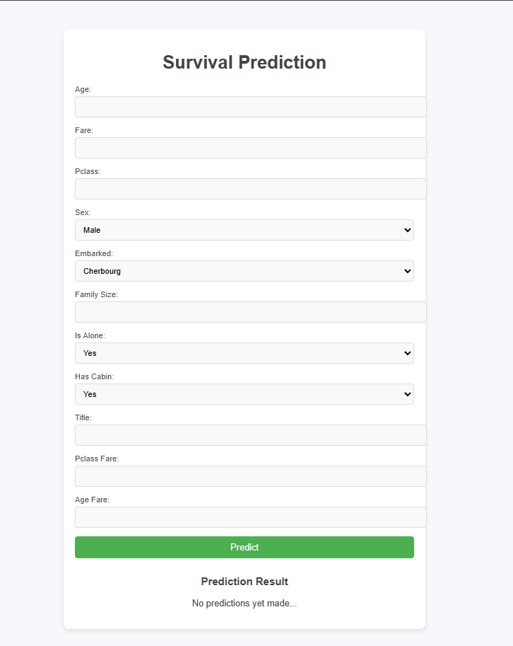

# 🚢 Titanic Survival Prediction - MLOps Project

This project demonstrates a full **MLOps pipeline** for predicting Titanic survival outcomes using a structured ML system. The pipeline includes data engineering, feature storing, model training, versioning, drift detection, and deployment with monitoring.

## 🔍 Project Highlights

- ✅ **ETL Pipeline using Apache Airflow**
- ✅ **Feature Store implementation with Redis**
- ✅ **Model training pipeline and code versioning**
- ✅ **Drift Detection using Alibi Detect**
- ✅ **ML Monitoring with Prometheus & Grafana**
- ✅ **Web UI (Flask) for prediction**
- ✅ **Fully Modular and Reproducible Setup**

---

## 🧠 Problem Statement

Predict whether a passenger survived the Titanic disaster based on features like age, fare, class, sex, and other relevant attributes.

---

## 📁 Project Structure
```
MLOPS_PROJECT_THREE/
│
├── airflow/ # Airflow DAGs for ETL Pipeline
├── artifacts/ # Stored artifacts
├── config/ # Configuration files
├── data/ # Titanic raw CSV files
├── logs/ # Log files
├── notebook/ # Jupyter notebooks
├── pipeline/ # Training pipeline orchestration
├── src/ # Source code (training, processing, utils)
│ ├── data_ingestion.py
│ ├── data_processing.py
│ ├── model_training.py
│ ├── feature_store.py
│ └── ...
├── static/ # Flask static assets (CSS, JS)
├── templates/ # Flask HTML template
├── app.py # Flask app for UI
├── Dockerfile # Docker container definition
├── docker-compose.yml # Multi-service orchestration
├── requirements.txt # Python dependencies
└── README.md # Project documentation 
```

---

## 🔧 Tech Stack

- **Python**
- **Apache Airflow**
- **Redis (Feature Store)**
- **Scikit-learn**
- **Flask**
- **Docker & Docker Compose**
- **Prometheus + Grafana (Monitoring)**
- **EvidentlyAI (Data Drift Detection)**

---

## 🔄 End-to-End Workflow

```
graph TD
    A[Project Setup] --> B[ETL Pipeline using Airflow]
    B --> C[Data Ingestion]
    C --> D[Feature Store Setup using Redis]
    D --> E[Data Processing with Feature Storing]
    E --> F[Model Training with Feature Extraction]
    F --> G[Training Pipeline]
    G --> H[Data and Code Versioning (GitHub)]
    F --> I[Jupyter Notebook Testing]
    E --> J[Data Drift Detection (EvidentlyAI)]
    J --> K[ML Monitoring (Prometheus + Grafana)]
    G --> L[User App Building (Flask, HTML)]
    L --> M[Done ✅]

```

## 🧪 Model Training
Model training is implemented using Scikit-learn with preprocessing pipelines that include:

- Feature Engineering (Family Size, Title, Age*Fare)

- Missing Value Imputation

- Scaling and Encoding

## 💻 Web Interface
Users can input data to predict Titanic survival via a clean and simple Flask-based UI:

Fields include: `Age`, `Fare`, `Pclass`, `Sex` , `Embarked`, `Family Size`, `Is Alone`, `Has Cabin Title`, `Pclass Fare`, `Age Fare`



## 📊 ML Monitoring
ML model and data drift is monitored using:

Alibi Detect for detecting changes in data distribution

Prometheus & Grafana to track API performance, CPU usage, and other system metrics.

## 🚀 How to Run Locally:

```
# Clone the repository
git clone https://github.com/your_username/titanic-mlops.git
cd titanic-mlops

# Start Airflow, Redis, and Flask via Docker Compose
docker-compose up --build

# Visit Flask App at:
http://localhost:5000
```
## 🛠️ Future Improvements

- Add CI/CD pipeline with GitHub Actions

- Use MLflow for experiment tracking

- Add advanced data versioning with DVC

- Deploy as a REST API with FastAPI

## 🤝 Contributing
Pull requests are welcome. For major changes, please open an issue first to discuss what you would like to change.

## 👨‍💻 Author  
Developed by Eduardo dos Santos Sousa.  
Feel free to contribute, report issues, or suggest improvements.
